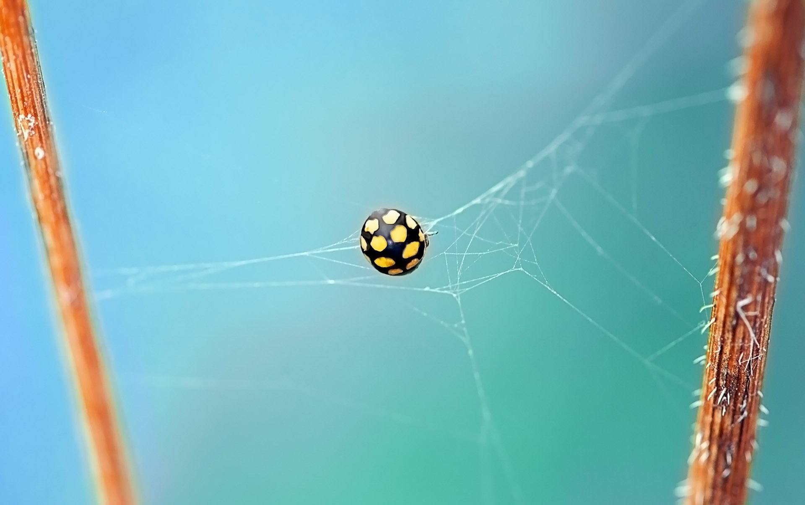

## Setting different box-shadow effects

You can actually set different box-shadow effects than the one provided using the `boxShadowTemplate` option.
```js
const boxShadowInstance = boxShadowPalette().init({
  hoverTarget: '.hoverTarget', 
  imageTarget: '.imageTarget', 
  boxShadowTemplate: '2px 3px 10px {color}'
})
```
You have two colors that you can use, `{color}` and `{colorSecondary}`. Both colors are RGBA and apply the opacity settings you provide defaulting to `.2`.
Settings opacity is easy using the `opacity` and `opacitySecondary` settings.

```js
const boxShadowInstance = boxShadowPalette().init({
  hoverTarget: '.hoverTarget', 
  imageTarget: '.imageTarget', 
  boxShadowTemplate: '2px 3px 10px {color}, 5px 2px 10px 5px {colorSecondary}',
  opacity: 0.5,
  opacitySecondary: 0.1
})
```

## Setting which color to use

Under the hood **boxShadowPalette** uses [Color Thief](http://lokeshdhakar.com/projects/color-thief/) which is a simple library to extract a color palette from an image.

**Color Thief** returns 8 colors from which to choose. **boxShadowPalette** is set to use the first one, but it is overridable with the `colorIndexToUse` option.

## Setting Enter and Leave events

If you want to use different events than `mouseenter` and `mouseleave` then supply them via da `enterEvent` and `leaveEvent`.
For example settings focus and blur events:

```js
const boxShadowInstance = boxShadowPalette().init({
  hoverTarget: '.focusTarget', // Element to attach event listener to (mouseenter bt default).
  imageTarget: '.imageTarget', // Image target that we will be sampled for colors.
  enterEvent: 'focus',
  leaveEvent: 'blur'
})
```

  <div class="image-list">
    <div class="hoverTarget focusTarget">
      
    </div>
    <div class="hoverTarget focusTarget">
      
    </div>
    <div class="hoverTarget focusTarget">
      
    </div>
    <div class="hoverTarget focusTarget">
      
    </div>
  </div>  
  
## Apply your own box-shadow template
  To apply a new box-shadow template all you have to do is pass your own `boxShadowTemplate` option.
  
  ```js
  const boxShadowInstance = boxShadowPalette().init({
    hoverTarget: '.customShadowTarget', // Element to attach event listener to (mouseenter bt default).
    imageTarget: '.imageTarget', // Image target that we will be sampled for colors.
    boxShadowTemplate: '0 2px 10px 5px {color}, 0 5px 15px 10px {colorSecondary}'
  })
  ```
  
   <div class="image-list">
      <div class="hoverTarget customShadowTarget">
        
      </div>
      <div class="hoverTarget customShadowTarget">
        
      </div>
      <div class="hoverTarget customShadowTarget">
        
      </div>
      <div class="hoverTarget customShadowTarget">
        
      </div>
    </div>  
  
<script>
  imagesLoaded('.imageTarget', function () {
    window.boxshadow = BoxShadowPalette().init({
        hoverTarget: '.focusTarget',
        imageTarget: '.imageTarget',
        enterEvent: 'mousedown',
        leaveEvent: 'mouseup'
      })
      
    window.boxshadow = BoxShadowPalette().init({
        hoverTarget: '.customShadowTarget',
        imageTarget: '.imageTarget',
        opacity: 0.5,
        boxShadowTemplate: '0 2px 10px 5px {color}, 0 5px 15px 10px {colorSecondary}'
    })
  })
</script>
